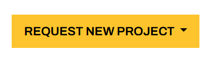
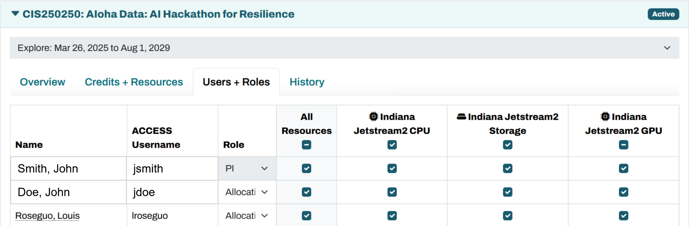

NSF ACCESS & Allocations
======

Note: This page was generated from a PowerPoint file. Formatting has been simplified.

ACCESS
------

- ACCESS
- Jetstream2 resources are obtained through ACCESS. ACCESS is a programestablished and funded by the NSF to help researchers and educators utilize advanced computing systems and services. Jetstream2 is but one of many resources made available through ACCESS, which standardizes the process of acquiring time with these resources through allocations of ACCESS credits. Applying for an allocation is like applying for a small grant.
.. image:: images/access_intro/slide1_img1.png
   :align: center
   :width: 800px

ACCESS Workflow
---------------

- ACCESS Workflow
- Create your ACCESS ID.PIs and end users both require an ACCESS ID - PIs to request and manage their allocation, users to login to resources.
- Select your project type based on your needs.In ascending order of size: Explore, Discover, Accelerate, and Maximize.
- Prepare and submit your allocation request.Requirements for a request increase along with allocation size, but Explore requests need little more than a project title and abstract.
- Receive and exchange your ACCESS credits.Once awarded, ACCESS credits are resource-neutral until they are applied toward specific computing resources.

ACCESS Allocations and Credits
------------------------------

- ACCESS Allocations and Credits
- Allocation types are categorized by amount of credits awarded, which are then exchanged for compute time and/or storage. For Jetstream2:
- 1 ACCESS credit = 1 Service Unit = 1 CPU hourCPU, GPU, or Large Memory
- or
- 1 ACCESS credit = 1 GB Storage
- Jetstream2 Usage Estimation Calculator

Allocation Details
------------------

- Allocation Details
- Allocation must be requested by the PI of the project
  - Any educator or researcher at a U.S. academic, non-profit research, or educational institution
  - Co-PIs can also be listed
  - Graduate students with an advisor letter of collaboration (Explore or Discover only)
- Allocations must be renewed annually
- Projects can be “upgraded” by applying for the next-level allocation tier

Managing Your Allocation
------------------------

- Managing Your Allocation
- Your allocations dashboard will list all your projects in one place. To reach the dashboard, login to ACCESS, navigate to Allocations, and click on My Projects.
.. image:: images/access_intro/slide5_img1.png
   :align: center
   :width: 800px

- ACCESS Allocations Page

Managing Your Allocation: Credits + Resources
---------------------------------------------

- Managing Your Allocation: Credits + Resources
- Unassigned Credits
.. image:: images/access_intro/slide6_img1.png
   :align: center
   :width: 800px

- Credits Exchanged,Organized by Resource
- Select Resource
- Brief Justification
- Unassigned Credits

Managing Your Allocation: Users + Roles
---------------------------------------

- Managing Your Allocation: Users + Roles

- Resource Permissions
- User Roles (PI, Co-PI, Allocation Manager, User)
