Introduction to Jetstream2
==========================

Note: This page was generated from a PowerPoint file. Formatting has been simplified.

Introduction to Jetstream2
--------------------------

- Introduction to Jetstream2
- Any opinions, findings, conclusions, or recommendations expressed in this material are those of the author(s) and do not necessarily reflect the views of the University of Hawaiʻi.
.. image:: images/js2_pptx/slide1_img1.png
   :align: center
   :width: 800px

Before We Begin
---------------

- Before We Begin
- Those who wish to participate in the tutorial - If you have not done so already:
- Create your ACCESS ID and share it in the chat.

Agenda
------

- Agenda
- Introduction to Jetstream2
- What is Jetstream2?
- Features
- Use Cases
- Interfaces
- Limitations
- ACCESS Allocations
- Logging into Exosphere
- Demo
- Tutorial
- Using Exosphere
  - Creating and accessing your instance
  - Software
  - Volume/storage management
  - Transferring data to and from your instance
  - Saving and sharing images
  - Instance management best practices

What is Jetstream2?
-------------------

- What is Jetstream2?
- Jetstream2 is a high-performance cloud computing environment which provides resources to researchers and educators across the US through the National Science Foundation (NSF)-funded Advanced Cyberinfrastructure Coordination Ecosystem: Services & Support (ACCESS) program. Jetstream2 is designed to be user-friendly and accessible to both advanced users and those who have had little to no experience with high-performance computing (HPC) resources. Jetstream2 is run by the Pervasive Technology Institute at Indiana University.
.. image:: images/js2_pptx/slide4_img1.png
   :align: center
   :width: 800px

.. image:: images/js2_pptx/slide4_img2.png
   :align: center
   :width: 800px

.. image:: images/js2_pptx/slide4_img3.png
   :align: center
   :width: 800px

Regional Partners
-----------------

- Regional Partners
.. image:: images/js2_pptx/slide5_img1.png
   :align: center
   :width: 800px

Features
--------

- Features
- Create and administer your own virtual machines
  - Install and configure software
  - Control via web shell, virtual desktop, or through SSH
- On-demand resources, no queues or runtime limits
- Internet access with persistent IPs, ideal for web hosting or gateways
- Resources are available at no cost to end users thanks to support from the NSF

Specifications
--------------

- Specifications
- 8 petaFLOPS cloud computing system, 17.2 petabytes of storage
- Compute: 416 nodes AMD EPYC CPUs with 128 cores + 512gb RAM
- GPU: 90 nodes, 4 NVIDIA A100 40gb
- Large Memory: 32 nodes, up to 1TB of RAM
- NVMe default VM root disks and storage

Jetstream2 Resource Types
-------------------------

- Jetstream2 Resource Types
- CPU: 1 CPU core, 3 GB RAM up to 64 CPU cores, 250 GB RAM*
- Large Memory: Up to 128 CPU cores, 1000 GB RAM
  - Double the RAM of equivalent CPU instances
- GPU: From 8 GB VRAM, 3 CPU cores, 15 GB RAM partial GPU up to a fullNVIDIA 40 GB A100 GPU, 32 CPU cores, 125 GB RAM
- Storage: 1 TB default, more on request
- * Default CPU instances capped at 64 CPU cores. 128 CPU cores,500 GB available by request and with proper justification.

Use Cases
---------

- Use Cases
- Teaching a course
  - Give students access to powerful computing for high-performance analysis
  - Individual virtual machines for practicing network security and reproducible development environments
- Working with code
  - Write, debug, and execute with interactive GUI applications
  - Use GPUs to train and refine ML/LLMs
- Long running services
  - Databases
  - Web applications
  - Inference services
- Sharing with students and colleagues
  - Host a file server or database
  - Receive, store, and serve data

Use Case: Hawaiʻi Climate Data Portal (HCDP)
--------------------------------------------

- Use Case: Hawaiʻi Climate Data Portal (HCDP)
- HCDP Allows users to visualize and download decades’ worth of climate data
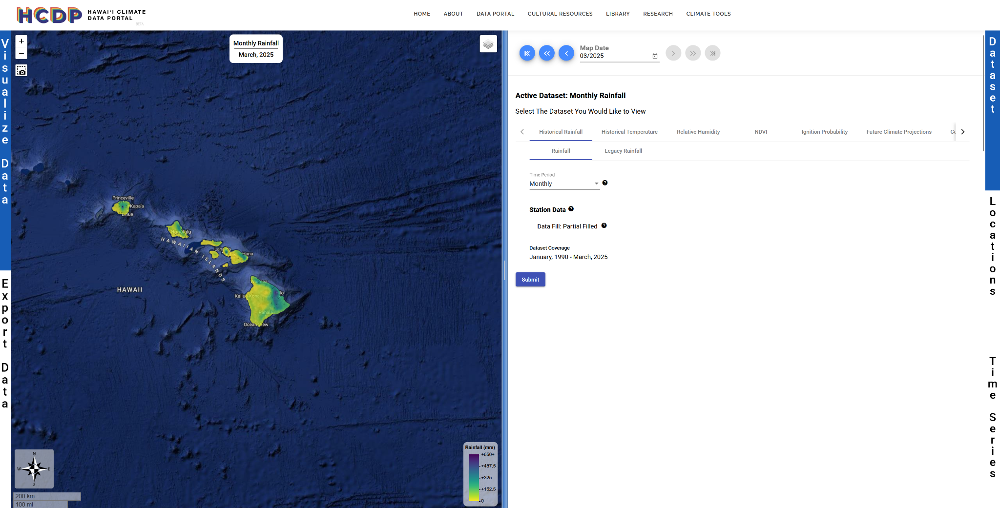

Jetstream2 Interfaces: Exosphere
--------------------------------

- Jetstream2 Interfaces: Exosphere
- Primary interface, most user-friendly
- Accessible via Guacamole web shell, graphical virtual desktop (optional), SSH
- Most limited
- Focus of tutorial
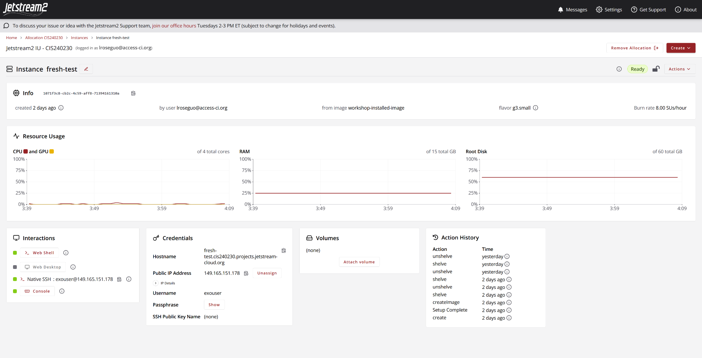

- Exosphere Web App

Jetstream2 Interfaces: Horizon
------------------------------

- Jetstream2 Interfaces: Horizon
- For advanced users, more tools, default OpenStack dashboard
- Most complete UI, but not as user-friendly
- Supports almost all functionality of the OpenStack API as the command line interface
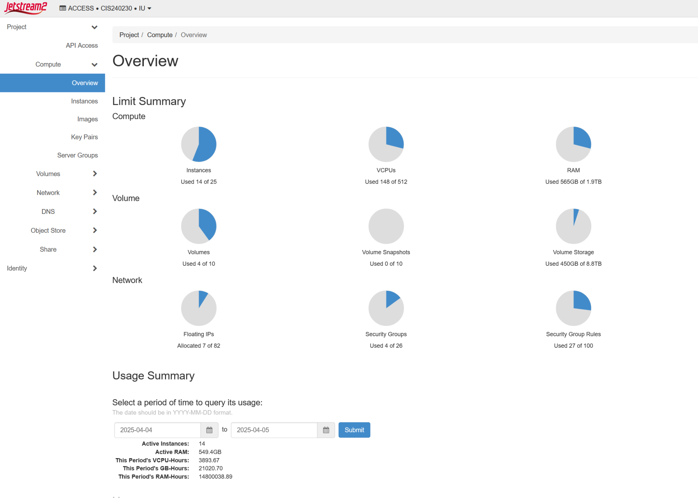

- Horizon Login

Jetstream2 Interfaces: CACAO
----------------------------

- Jetstream2 Interfaces: CACAO
- For advanced users, useful for building clusters or JupyterHub
- In Alpha
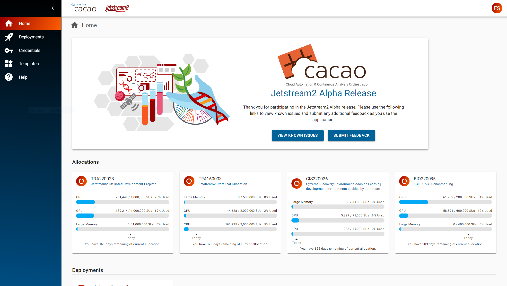

- CACAO Login

Limitations, Caveats, and Responsibilities
------------------------------------------

- Limitations, Caveats, and Responsibilities
- Research or education use only
  - No hosting personal or commercial websites
- Jetstream2 is not primarily a storage/archival service
  - Do you have a plan for your data if your allocation does not get renewed?
- Data protected by HIPAA, FERPA, ITAR and other federal or security or privacy laws, as well as classified information, is not currently permitted to be stored on Jetstream2.
- Users are responsible for administrating their own VMs
  - Jetstream2 Security FAQ
- Windows images are not officially supported

ACCESS
------

- ACCESS
- Jetstream2 resources are obtained through ACCESS. ACCESS is a programestablished and funded by the NSF to help researchers and educators utilize advanced computing systems and services. Jetstream2 is but one of many resources made available through ACCESS, which standardizes the process of acquiring time with these resources through allocations of ACCESS credits. Applying for an allocation is like applying for a small grant.

ACCESS Workflow
---------------

- ACCESS Workflow
- Create your ACCESS ID.PIs and end users both require an ACCESS ID - PIs to request and manage their allocation, users to login to resources.
- Select your project type based on your needs.In ascending order of size: Explore, Discover, Accelerate, and Maximize.
- Prepare and submit your allocation request.Requirements for a request increase along with allocation size, but Explore requests need little more than a project title and abstract.
- Receive and exchange your ACCESS credits.Once awarded, ACCESS credits are resource-neutral until they are applied toward specific computing resources.
.. image:: images/js2_pptx/slide16_img1.png
   :align: center
   :width: 800px

ACCESS Allocations and Credits
------------------------------

- ACCESS Allocations and Credits
- Allocation types are categorized by amount of credits awarded, which are then exchanged for compute time and/or storage. For Jetstream2:
- 1 ACCESS credit = 1 Service Unit = 1 CPU hourCPU, GPU, or Large Memory
- or
- 1 ACCESS credit = 1 GB Storage
- Jetstream2 Usage Estimation Calculator

Allocation Details
------------------

- Allocation Details
- Allocation must be requested by the PI of the project
  - Any educator or researcher at a U.S. academic, non-profit research, or educational institution
  - Co-PIs can also be listed
  - Graduate students with an advisor letter of collaboration (Explore or Discover only)
- Allocations must be renewed annually
- Projects can be “upgraded” by applying for the next-level allocation tier

Managing Your Allocation
------------------------

- Managing Your Allocation
- Your allocations dashboard will list all your projects in one place. To reach the dashboard, login to ACCESS, navigate to Allocations, and click on My Projects.
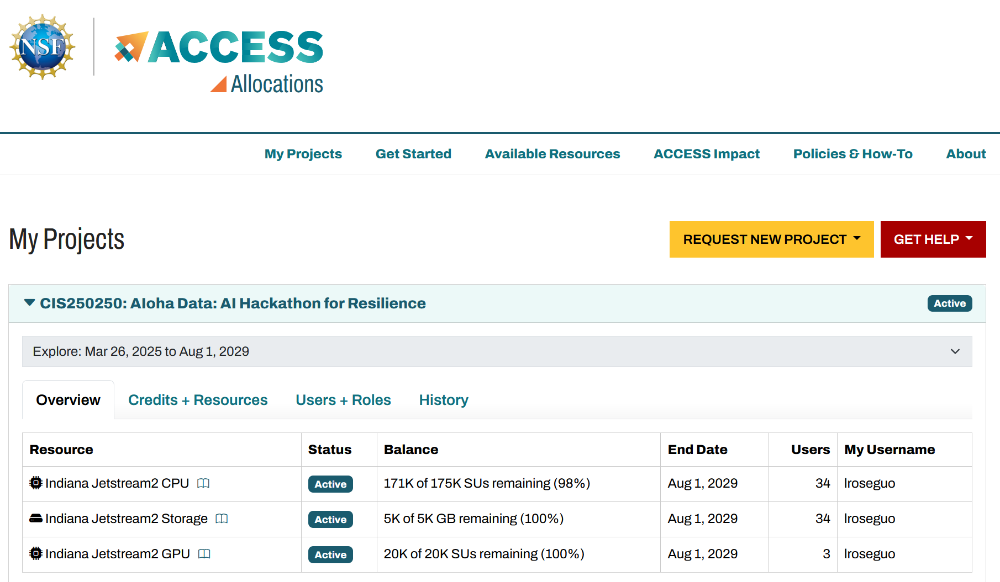

- ACCESS Allocations Page

Managing Your Allocation: Credits + Resources
---------------------------------------------

- Managing Your Allocation: Credits + Resources
- Unassigned Credits
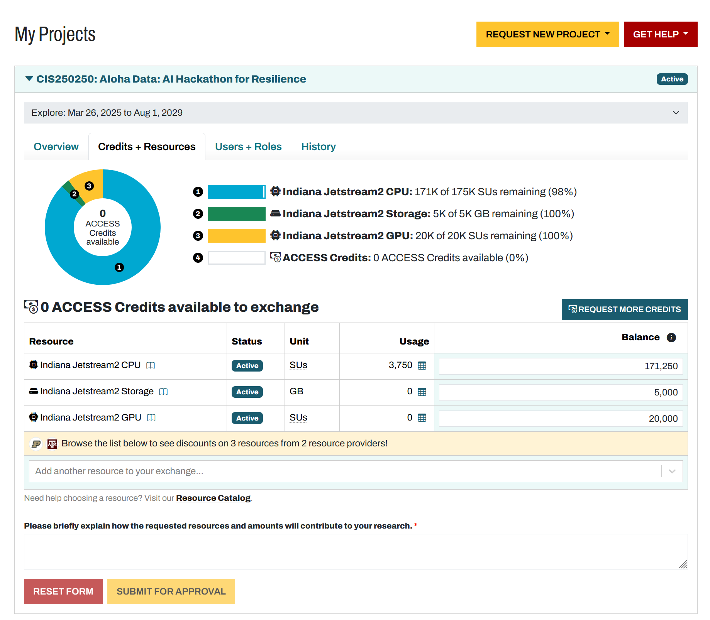

- Credits Exchanged,Organized by Resource
- Select Resource
- Brief Justification
- Unassigned Credits

Managing Your Allocation: Users + Roles
---------------------------------------

- Managing Your Allocation: Users + Roles
.. image:: images/js2_pptx/slide21_img1.png
   :align: center
   :width: 800px

- Resource Permissions
- User Roles (PI, Co-PI, Allocation Manager, User)

Exosphere: Logging In
---------------------

- Exosphere: Logging In
- Before you can log in to Jetstream2, you must have or be added to Jetstream2resources on an active ACCESS allocation.
- Log in to Exosphere:
- jetstream2.exosphere.app

Exosphere: Logging In
---------------------

- Exosphere: Logging In
- 1. Select “Add allocation.”
.. image:: images/js2_pptx/slide23_img1.png
   :align: center
   :width: 800px

Exosphere: Logging In
---------------------

- Exosphere: Logging In
- 2. Select “Add ACCESS Account.”
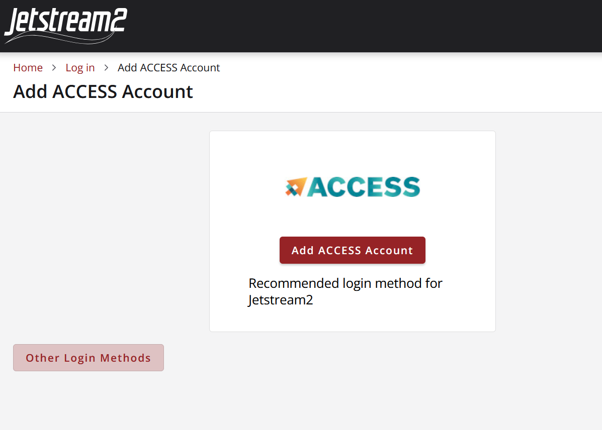

Exosphere: Logging In
---------------------

- Exosphere: Logging In
- 3. From the dropdown menu, select “ACCESS CI (XSEDE)” as your identity provider.
.. image:: images/js2_pptx/slide25_img1.png
   :align: center
   :width: 800px

Exosphere: Logging In
---------------------

- Exosphere: Logging In
- 4. Enter and log in with your ACCESS credentials.
.. image:: images/js2_pptx/slide26_img1.png
   :align: center
   :width: 800px

Exosphere: Logging In
---------------------

- Exosphere: Logging In
- 5. Select your allocation. For the tutorial, select CIS250250.
.. image:: images/js2_pptx/slide27_img1.png
   :align: center
   :width: 800px

Exosphere: Logging In
---------------------

- Exosphere: Logging In
- 6. The allocation should now appear on the Exosphere Home page.You are ready to begin working with Jetstream2.
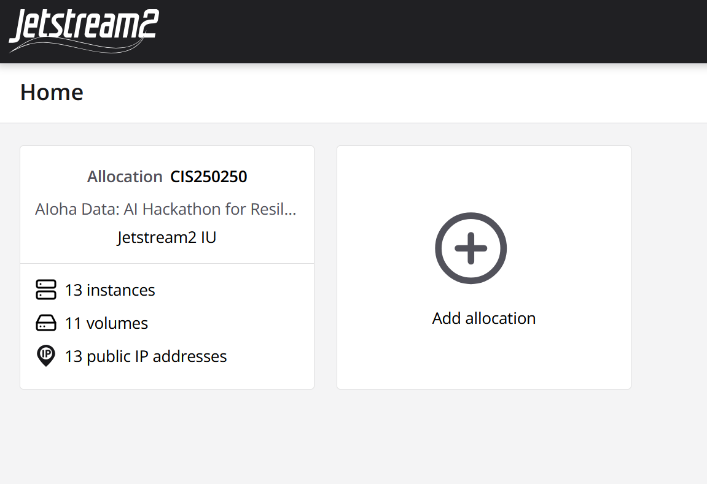

Workshop Allocation
-------------------

- Workshop Allocation
- Workshop participants may continue to experiment with the workshopallocation for approximately 24 hours, but will be removed from resources shortly afterwards. Participants who were already on the allocation will not be removed, but will be unassigned from resources which they did not already have access to.

Next Steps: Jetstream2 Trial Allocation
---------------------------------------

- Next Steps: Jetstream2 Trial Allocation
- Test drive Jetstream2 before getting your own ACCESS allocation
  - 90 days of Jetstream2 usage
  - Limited resources: 1 m3.tiny or one m3.small virtual machine instance
    - GPUs not available in trial allocation
  - 1 virtual machine backup snapshot per instance
  - 10 GB disk storage volume
- Sign up for a trial allocation
  - Register your ACCESS ID
  - Visit the Jetstream2 trial allocation portal and select “enroll”
    - If using Exosphere, the allocation is named with your ACCESS username plus “JTA User”
    - If using Horizon, it is labeled with only your ACCESS username
- Jetstream2 Trial Allocation Portal

Resources
---------

- Resources
- Jetstream2 Training and Events by IU: https://jetstream-cloud.org/news-events/events/index.html
- LLM Web-chat Interface Tutorial: https://docs.jetstream-cloud.org/general/llm/
- ACCESS User Registration: https://operations.access-ci.org/identity/new-user
- ACCESS Allocations Portal: https://allocations.access-ci.org/
- ACCESS Support: https://support.access-ci.org/open-a-ticket
- ACCESS Project Types: https://allocations.access-ci.org/project-types
- Preparing ACCESS Requests: https://allocations.access-ci.org/prepare-requests
- Jetstream2 Getting Started User Guide: https://docs.jetstream-cloud.org/getting-started/overview/
- Exosphere: https://jetstream2.exosphere.app/exosphere/home
- Jetstream2 Website: https://jetstream-cloud.org/
- Jetstream2 Documentation: https://docs.jetstream-cloud.org/
- Jetstream2 Usage Estimation Calculator: https://docs.jetstream-cloud.org/alloc/estimator/
- Jetstream2 Instance Flavors: https://docs.jetstream-cloud.org/general/vmsizes/
- Hugging Face: https://huggingface.co/
- Llama-3.2-1B-Instruct: https://huggingface.co/meta-llama/Llama-3.2-1B-Instruct
- Research Cyberinfrastructure at UH: https://www.hawaii.edu/its/ci/index.html

Appendices
----------

- Appendices
- A: Creating an ACCESS Account
- B: Requesting an Allocation
- C: Tutorial: Deploying an LLM With Web-chat Interface
- D: Acronyms

Appendix A: Creating an ACCESS Account
--------------------------------------

- Appendix A: Creating an ACCESS Account
- Navigate to https://operations.access-ci.org/identity/new-userin the browser and click on “Register with an existing identity.”
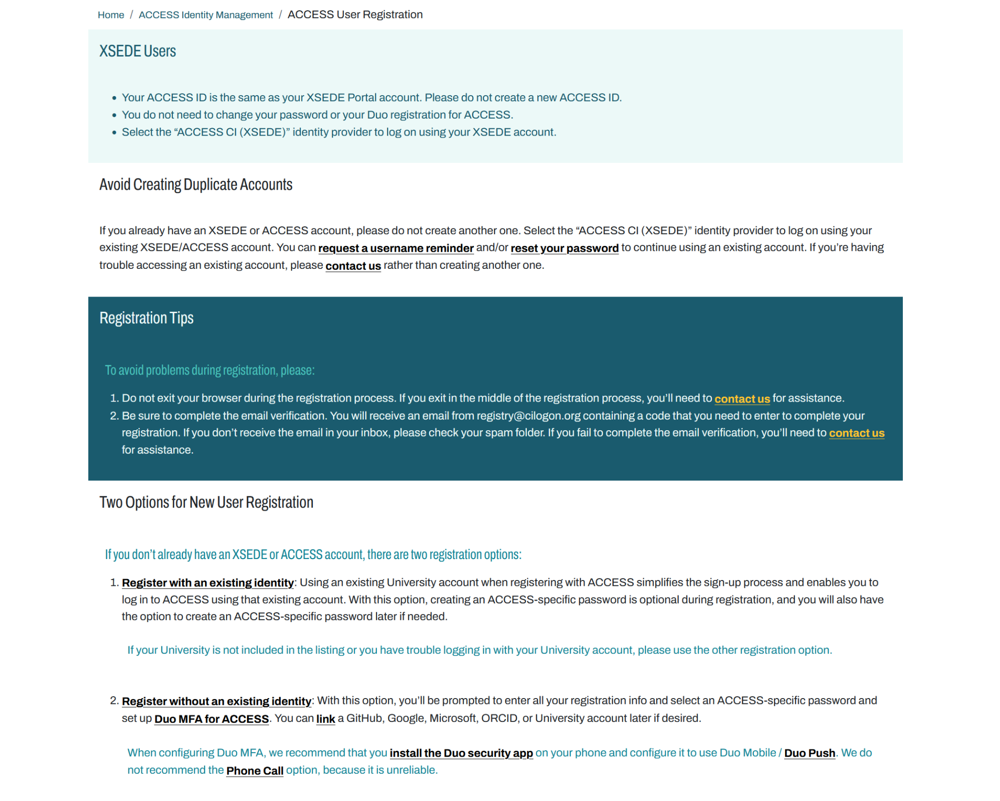

Appendix A: Creating an ACCESS Account
--------------------------------------

- Appendix A: Creating an ACCESS Account
- 2. Select your institution under “Select an Identity Provider” and click “Log On.”
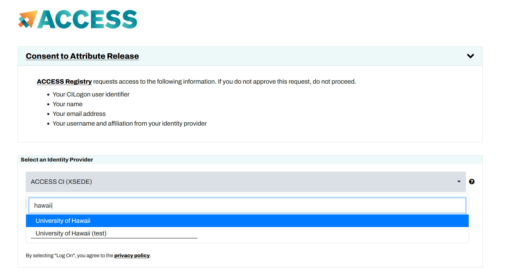

Appendix A: Creating an ACCESS Account
--------------------------------------

- Appendix A: Creating an ACCESS Account
- 3. Log in with your institution credentials and complete the registration process.
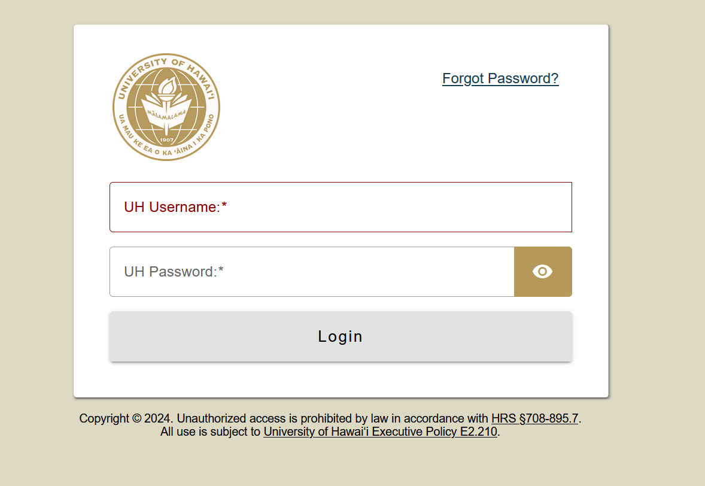

Appendix A: Creating an ACCESS Account
--------------------------------------

- Appendix A: Creating an ACCESS Account
- 4. Once registered, expect an email with your new ACCESS ID username.In the future, when prompted by a resource to log in with ACCESS, select “ACCESS CI (XSEDE)” instead of your institution.
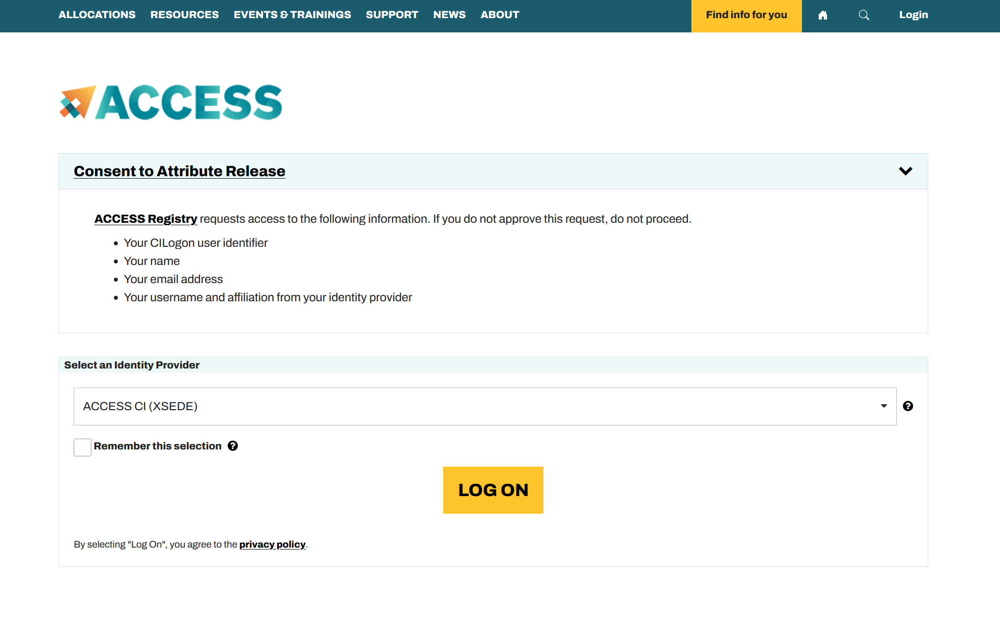

Appendix B: Requesting an Allocation
------------------------------------

- Appendix B: Requesting an Allocation
- Navigate the browser to the ACCESS Allocations portal.Click on “Request New Project.”
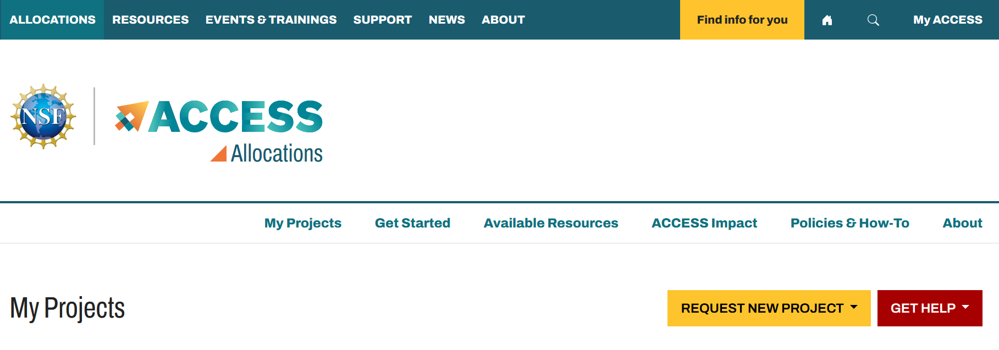

- Project Types
- Project Requirements

Appendix B: Requesting an Allocation
------------------------------------

- Appendix B: Requesting an Allocation
- 2. Select a project type based on your needs.
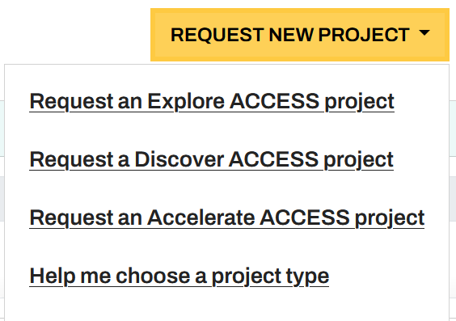

Appendix B: Requesting an Allocation
------------------------------------

- Appendix B: Requesting an Allocation
- 3. Fill out all relevant information and upload any supporting documents(e.g. CV, class syllabus, advisor letter for graduate students, etc.). You can assign Co-PIs and allocation managers as well. Larger project types require more detailed requests.
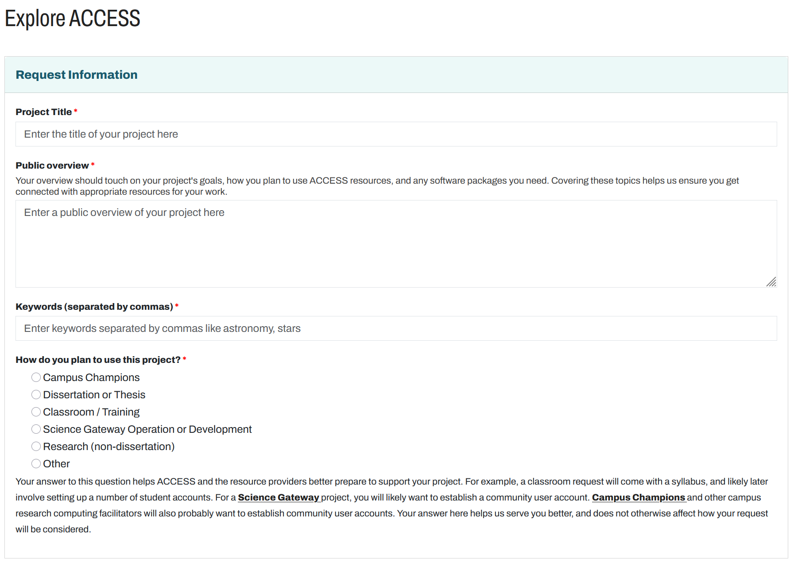

Appendix B: Requesting an Allocation
------------------------------------

- Appendix B: Requesting an Allocation
- 4. Expect an email to notify you of the outcome.Explore requests may be granted as soon as the next business day.
- 5. Exchange ACCESS credits for resources.
- 6. Add users to resources.

Appendix C: Tutorial
--------------------

- Appendix C: Tutorial
- In this tutorial, users will deploy a Large Language Model (LLM) on Jetstreamwith a web-chat interface using the following tools:
- The model will be served using vLLM.
- The chat interface is provided by Open Web UI.
- Caddy will run the HTTPS server.

C.1 Tutorial (Pre-Image)
------------------------

- C.1 Tutorial (Pre-Image)
- Begin by clicking on the “Create” button on the top right of the Exosphereallocation page and selecting “Instance.”
.. image:: images/js2_pptx/slide42_img1.png
   :align: center
   :width: 800px

C.1 Tutorial (Pre-Image)
------------------------

- C.1 Tutorial (Pre-Image)
- 2. Select the latest Ubuntu distribution.
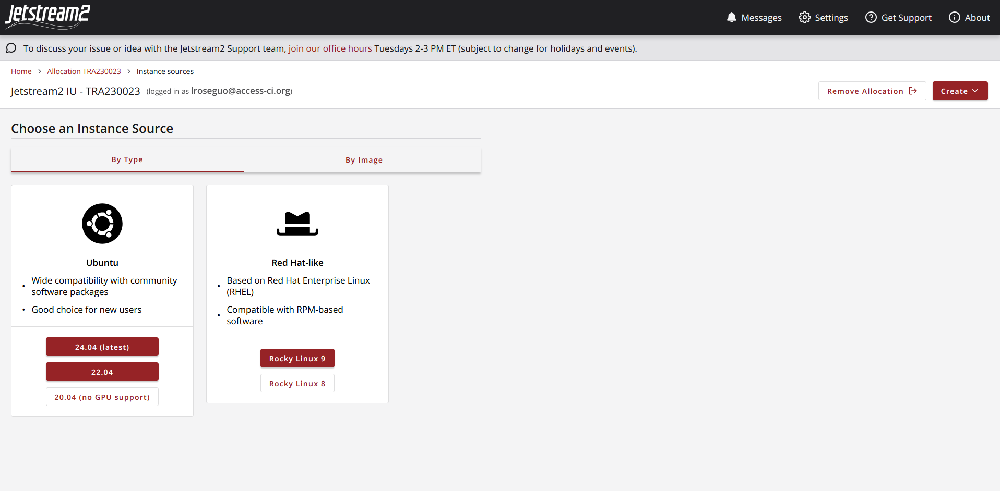

C.1 Tutorial (Pre-Image)
------------------------

- C.1 Tutorial (Pre-Image)
- 3. Provide a name for theinstance and select “g3.medium.”
- If desiring a graphical remote desktop,select “Yes” under “Enable web desktop.”
- Leave other values default.
.. image:: images/js2_pptx/slide44_img1.png
   :align: center
   :width: 800px

C.1 Tutorial (Pre-Image)
------------------------

- C.1 Tutorial (Pre-Image)
- 4. Wait until the instance is ready to use.
.. image:: images/js2_pptx/slide45_img1.png
   :align: center
   :width: 800px

.. image:: images/js2_pptx/slide45_img2.png
   :align: center
   :width: 800px

C.1 Tutorial (Pre-Image)
------------------------

- C.1 Tutorial (Pre-Image)
- 5. Log into the instance via SSH or the web shell.
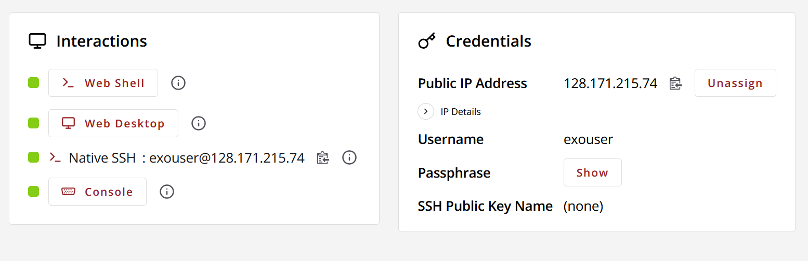

C.1 Tutorial (Pre-image)
------------------------

- C.1 Tutorial (Pre-image)
- 6. Install miniforge:
- 7. When prompted, press Enter to view the agreement.8. Press Space to advance through the license.9. When prompted, type yes and press Enter to continue.10. Press Enter again to install in the default location.11. Choose whether to allow the shell to automatically initialize condaon startup. In this example, we will type yes and press Enter.
- curl -L -O "https://github.com/conda-forge/miniforge/releases/latest/download/Miniforge3-$(uname)-$(uname -m).sh"
- bash Miniforge3-$(uname)-$(uname -m).sh

C.1 Tutorial (Pre-image)
------------------------

- C.1 Tutorial (Pre-image)
- 12. Relaunch the shell to initialize conda:
- 13. Create vllm environment:
- The installation takes a long time, which is why we are doing it inadvance and saving an image for the workshop.
- source ~/.bashrc
- conda create -y -n vllm python=3.11
- conda activate vllm
- pip install vllm

C.1 Tutorial (Pre-image)
------------------------

- C.1 Tutorial (Pre-image)
- 14. Create open-webui environment:
- Once open-webui is installed, this is the point at which an image of the instance is created.The image used in the workshop begins here.
- conda create -y -n open-webui python=3.11
- conda activate open-webui
- pip install open-webui

C.2 Tutorial (Post-image)
-------------------------

- C.2 Tutorial (Post-image)
- Click on the “Create” button in Exosphere and select “Instance.”
.. image:: images/js2_pptx/slide50_img1.png
   :align: center
   :width: 800px

C.2 Tutorial (Post-image)
-------------------------

- C.2 Tutorial (Post-image)
- 2. Click on “By Image” to view the images on the allocation and selectthe workshop image - in this case workshop-llm-image
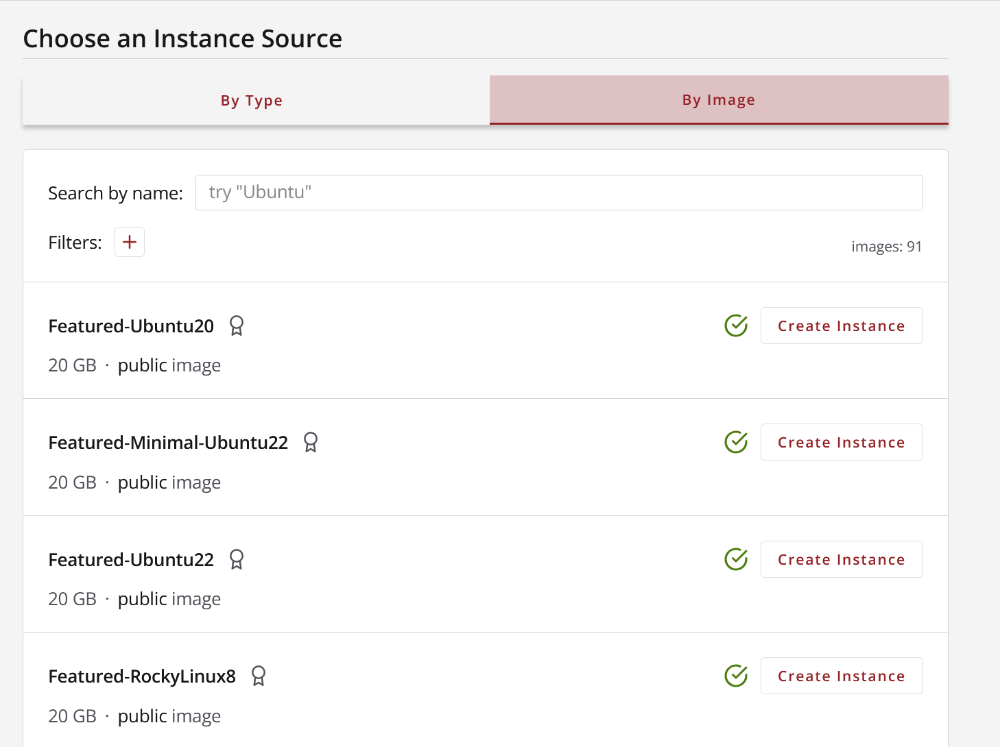

C.2 Tutorial (Post-image)
-------------------------

- C.2 Tutorial (Post-image)
- 3. Provide a name for theinstance and select “g3.small.”If desiring a graphical remote desktop,select “Yes” under “Enable web desktop.”Leave other values default.
.. image:: images/js2_pptx/slide52_img1.png
   :align: center
   :width: 800px

C.2 Tutorial (Post-image)
-------------------------

- C.2 Tutorial (Post-image)
- 4. Wait until the instance is ready to use.
.. image:: images/js2_pptx/slide53_img1.png
   :align: center
   :width: 800px

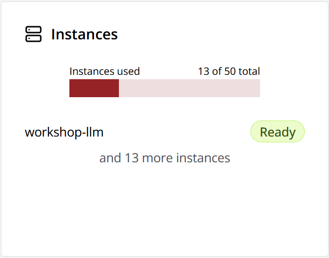

C.2 Tutorial (Post-image)
-------------------------

- C.2 Tutorial (Post-image)
- 4. Log into the instance via SSH or the web shell.
.. image:: images/js2_pptx/slide54_img1.png
   :align: center
   :width: 800px

C.2 Tutorial (Post-image)
-------------------------

- C.2 Tutorial (Post-image)
- 5. Activate vllm environment:
- 6. Log into Hugging Face:
- You will be prompted to enter a token:
- conda activate vllm
- huggingface-cli login
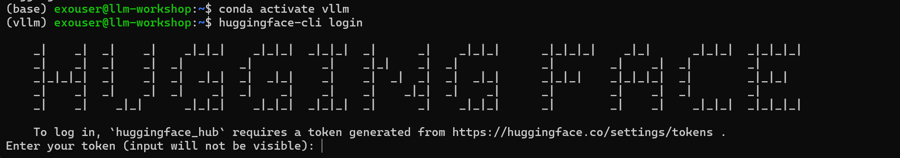

C.2 Tutorial (Post-image)
-------------------------

- C.2 Tutorial (Post-image)
- 7. In the browser, navigate to https://huggingface.co/settings/tokens andclick on “Create new token” at the top right of the page.
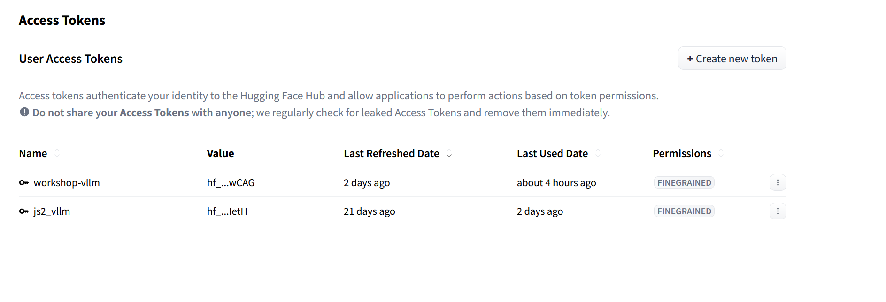

C.2 Tutorial (Post-image)
-------------------------

- C.2 Tutorial (Post-image)
- 8. Provide a name for the token, then select the model (in this example, meta-llama/Llama-3.2-1B-Instruct) under “Repositories Permissions.”For this workshop, the token only needs Read permissions.Click “Create token” at the bottom of the page.
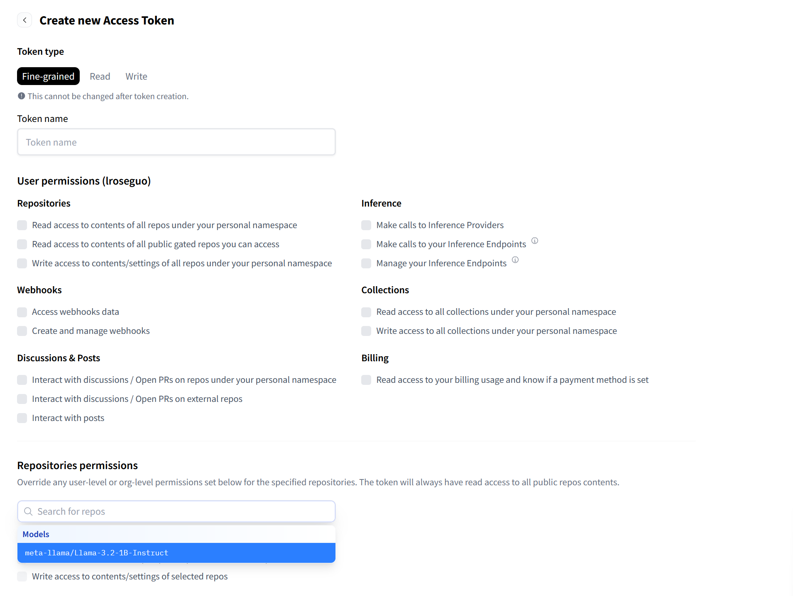

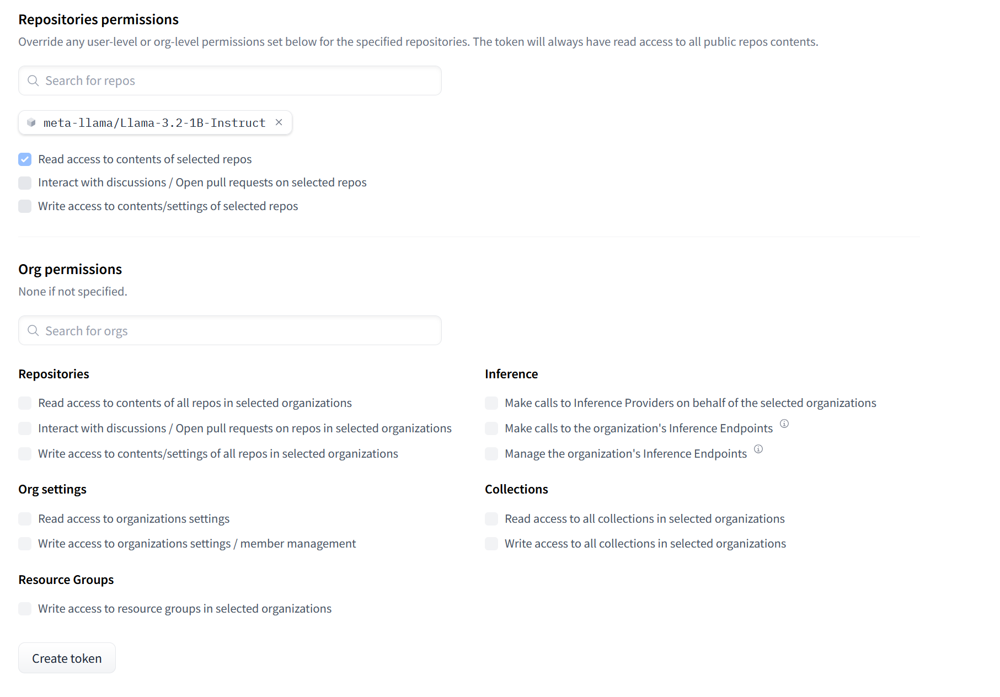

C.2 Tutorial (Post-image)
-------------------------

- C.2 Tutorial (Post-image)
- 9. Save the token somewhere safe, then return to the terminal and paste.You will be prompted to add the token as a git credential. For this tutorial, we will answer n and press Enter.
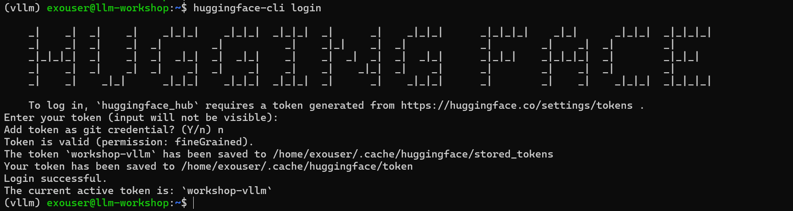

C.2 Tutorial (Post-image)
-------------------------

- C.2 Tutorial (Post-image)
- Optional: To confirm login success, run:
- Your Hugging Face username should be displayed.
- huggingface-cli whoami
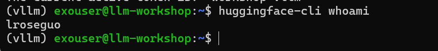

C.2 Tutorial (Post-image)
-------------------------

- C.2 Tutorial (Post-image)
- Serving the model, version A:
- meta-llama/Llama-3.2-1B-Instruct

C.2 Tutorial (Post-image)
-------------------------

- C.2 Tutorial (Post-image)
- 10. Now we can try serving the model:
- This may take a few minutes to run the first time. Once the terminal prints out “INFO: Application startup complete” and prints a message every ten seconds, that indicates that it is running successfully. The process will continue running on its own until we kill it with Ctrl-C.
- vllm serve "meta-llama/Llama-3.2-1B-Instruct" --max-model-len=8192 --gpu-memory-utilization 0.85 --max-num-seqs 256
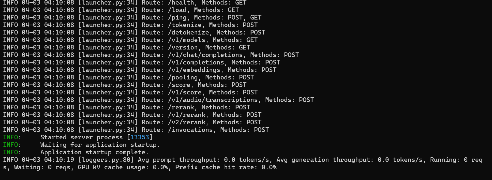

C.2 Tutorial (Post-image)
-------------------------

- C.2 Tutorial (Post-image)
- 11. Create a service for running the model by creating a file /etc/systemd/system/vllm.service with the following contents:
- [Unit]
- Description=VLLM model serving
- After=network.target
- [Service]
- User=exouser
- Group=exouser
- WorkingDirectory=/home/exouser
- # Activating the conda environment and starting the service
- ExecStart=/bin/bash -c "source /home/exouser/miniforge3/etc/profile.d/conda.sh && conda activate vllm && vllm serve 'meta-llama/Llama-3.2-1B-Instruct' --max-model-len=8192 --gpu-memory-utilization 0.85 --max-num-seqs 256"
- Restart=always
- Environment=PATH=/home/exouser/miniforge3/envs/llm/bin:/usr/local/sbin:/usr/local/bin:/usr/sbin:/usr/bin:/sbin:/bin
- [Install]
- WantedBy=multi-user.target

C.2 Tutorial (Post-image)
-------------------------

- C.2 Tutorial (Post-image)
- Serving the model, version B:
- TinyLlama/TinyLlama-1.1B-Chat-v1.0

C.2 Tutorial (Post-image)
-------------------------

- C.2 Tutorial (Post-image)
- 10. Now we can try serving the model:
- This may take a few minutes to run the first time. Once the terminal prints out “INFO: Application startup complete” and prints a message every ten seconds, that indicates that it is running successfully. The process will continue running on its own until we kill it with Ctrl-C.
- vllm serve "TinyLlama/TinyLlama-1.1B-Chat-v1.0" --max-model-len 2048 --gpu_memory_utilization 0.85 --enforce-eager
.. image:: images/js2_pptx/slide64_img1.png
   :align: center
   :width: 800px

C.2 Tutorial (Post-image)
-------------------------

- C.2 Tutorial (Post-image)
- 11. Create a service for running the model by creating a file /etc/systemd/system/vllm.service with the following contents:
- [Unit]
- Description=VLLM model serving
- After=network.target
- [Service]
- User=exouser
- Group=exouser
- WorkingDirectory=/home/exouser
- # Activating the conda environment and starting the service
- ExecStart=/bin/bash -c "source /home/exouser/miniforge3/etc/profile.d/conda.sh && conda activate vllm && vllm serve 'TinyLlama/TinyLlama-1.1B-Chat-v1.0' --max-model-len 2048 --gpu_memory_utilization 0.85 --enforce-eager"
- Restart=always
- Environment=PATH=/home/exouser/miniforge3/envs/llm/bin:/usr/local/sbin:/usr/local/bin:/usr/sbin:/usr/bin:/sbin:/bin
- [Install]
- WantedBy=multi-user.target

C.2 Tutorial (Post-image)
-------------------------

- C.2 Tutorial (Post-image)
- 12. Enable and start the service:
- In case of errors:Check the logs with sudo journalctl -u vllmCheck the status with sudo systemctl status vllm
- sudo systemctl enable vllm
- sudo systemctl start vllm

Appendix D: Acronyms
--------------------

- Appendix D: Acronyms
- NSF - National Science Foundation
- ACCESS - Advanced Cyberinfrastructure Coordination Ecosystem: Services & Support
- NAIRR Pilot - National Artificial Intelligence Research Resource Pilot
- HPC - High-Performance Computing
- VM - Virtual Machine
- EPSCoR - Established Program to Stimulate Competitive Research
- LLM - Large Language Model
- HIPAA - Health Insurance Portability and Accountability Act
- FERPA - Family Educational Rights and Privacy Act
- ITAR - International Traffic Arms and Regulations Act
- IU - Indiana University
