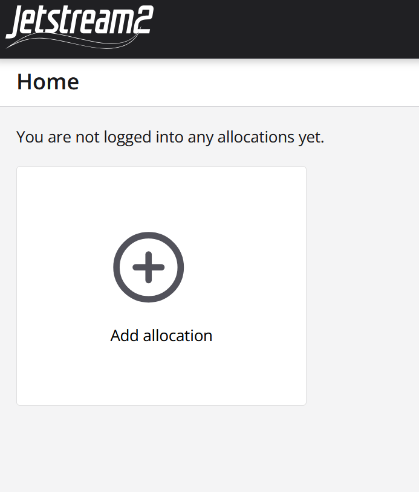
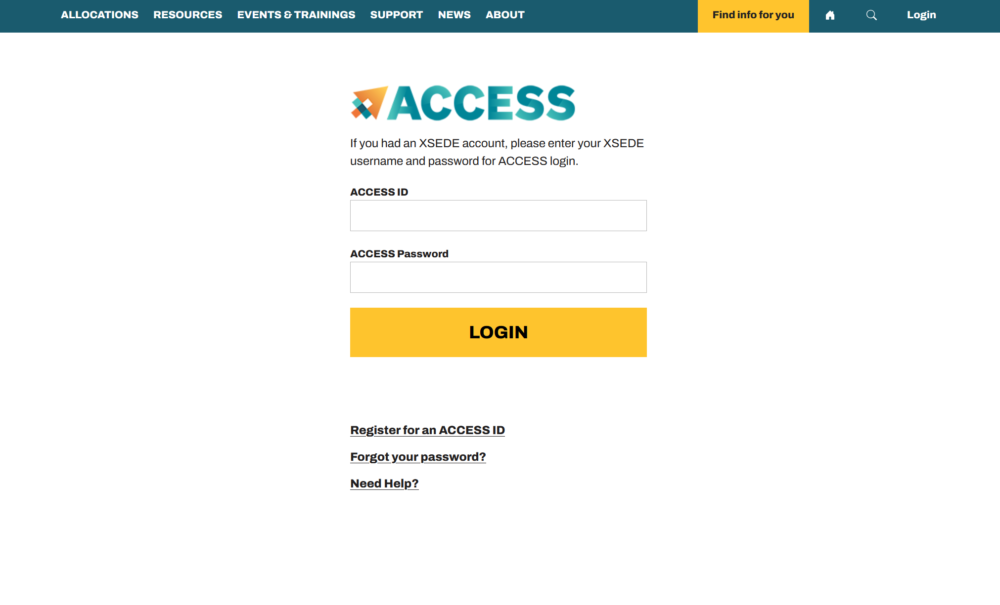
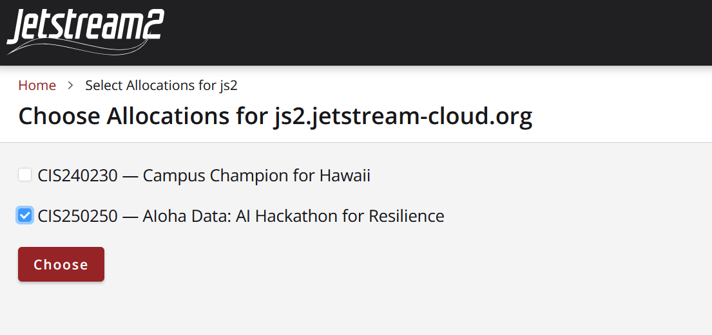
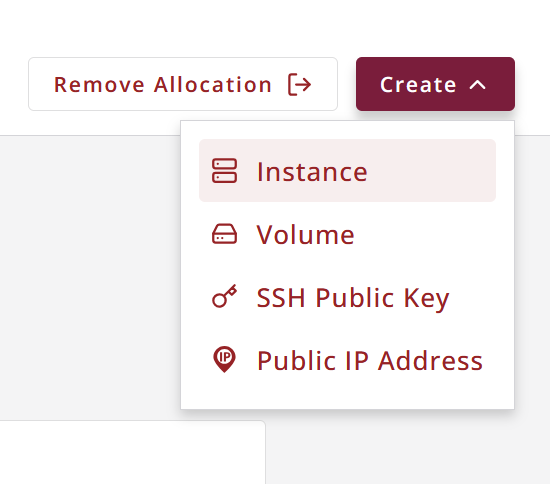
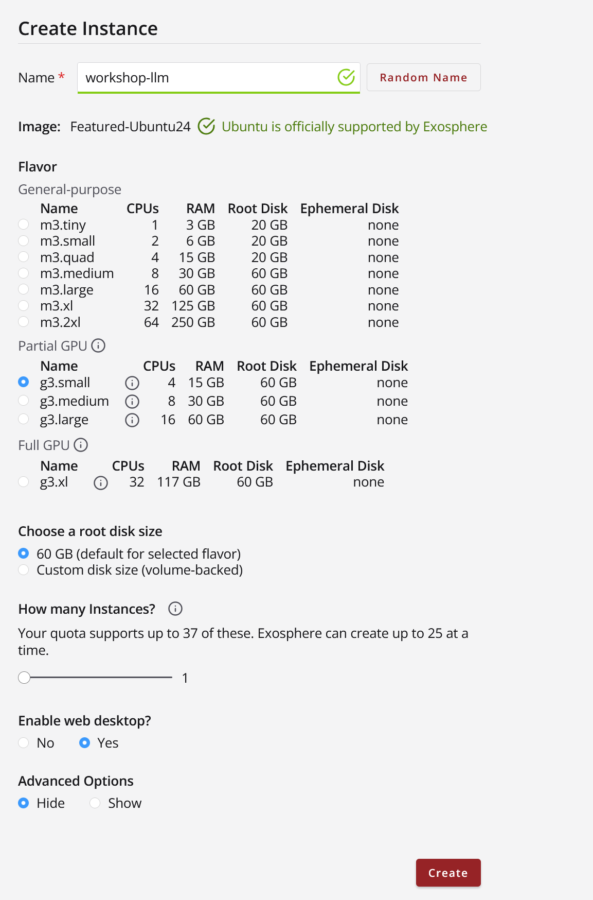
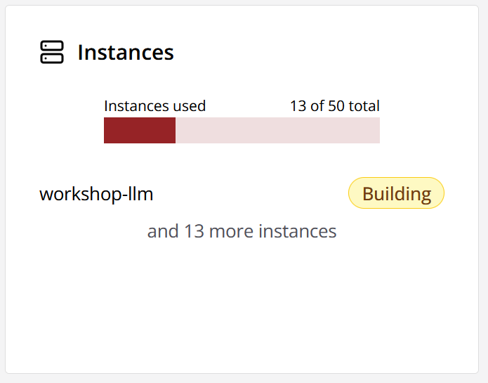
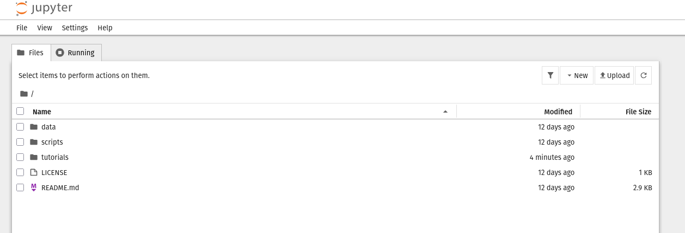

Tutorial Jetstream2 & Jupyter Setup
=====================

Note: This page was generated from a PowerPoint file. Formatting has been simplified.

Exosphere: Logging In
---------------------

- Exosphere: Logging In
- Before you can log in to Jetstream2, you must have or be added to Jetstream2resources on an active ACCESS allocation.
- Log in to Exosphere:  https://jetstream2.exosphere.app/

Exosphere: Logging In
---------------------

- Exosphere: Logging In
- 1. Select “Add allocation.”

2. Select “Add ACCESS Account.”
-------------------------------

- 2. Select “Add ACCESS Account.”
.. image:: images/tutorial_jetstream2_setup/slide3_img1.png
   :align: center
   :width: 800px

3. From the dropdown menu, select “ACCESS CI (XSEDE)” as your identity provider.
--------------------------------------------------------------------------------

- 3. From the dropdown menu, select “ACCESS CI (XSEDE)” as your identity provider.
.. image:: images/tutorial_jetstream2_setup/slide4_img1.png
   :align: center
   :width: 800px

4. Enter and log in with your ACCESS credentials.
-------------------------------------------------

- 4. Enter and log in with your ACCESS credentials.

5. Select your allocation. For the tutorial, select CIS250250.
--------------------------------------------------------------

- 5. Select your allocation. For the tutorial, select CIS250250.

6. The allocation should now appear on the Exosphere Home page.You are ready to begin working with Jetstream2.
---------------------------------------------------------------------------------------------------------------

- 6. The allocation should now appear on the Exosphere Home page.You are ready to begin working with Jetstream2.
.. image:: images/tutorial_jetstream2_setup/slide7_img1.png
   :align: center
   :width: 800px

Workshop Allocation
-------------------

- Workshop Allocation
- Workshop participants may continue to experiment with the workshopallocation for approximately 24 hours, but will be removed from resources shortly afterwards. Participants who were already on the allocation will not be removed, but will be unassigned from resources which they did not already have access to.

Next Steps: Jetstream2 Trial Allocation
---------------------------------------

- Next Steps: Jetstream2 Trial Allocation
- Test drive Jetstream2 before getting your own ACCESS allocation
  - 90 days of Jetstream2 usage
  - Limited resources: 1 m3.tiny or one m3.small virtual machine instance
    - GPUs not available in trial allocation
  - 1 virtual machine backup snapshot per instance
  - 10 GB disk storage volume
- Sign up for a trial allocation
  - Register your ACCESS ID
  - Visit the Jetstream2 trial allocation portal and select “enroll” https://portal.jetstream-cloud.org/
    - If using Exosphere, the allocation is named with your ACCESS username plus “JTA User”
    - If using Horizon, it is labeled with only your ACCESS username
- Jetstream2 Trial Allocation Portal

Resources
---------

- Resources
- Jetstream2 Training and Events by IU: https://jetstream-cloud.org/news-events/events/index.html
- LLM Web-chat Interface Tutorial: https://docs.jetstream-cloud.org/general/llm/
- ACCESS User Registration: https://operations.access-ci.org/identity/new-user
- ACCESS Allocations Portal: https://allocations.access-ci.org/
- ACCESS Support: https://support.access-ci.org/open-a-ticket
- ACCESS Project Types: https://allocations.access-ci.org/project-types
- Preparing ACCESS Requests: https://allocations.access-ci.org/prepare-requests
- Jetstream2 Getting Started User Guide: https://docs.jetstream-cloud.org/getting-started/overview/
- Exosphere: https://jetstream2.exosphere.app/exosphere/home
- Jetstream2 Website: https://jetstream-cloud.org/
- Jetstream2 Documentation: https://docs.jetstream-cloud.org/
- Jetstream2 Usage Estimation Calculator: https://docs.jetstream-cloud.org/alloc/estimator/
- Jetstream2 Instance Flavors: https://docs.jetstream-cloud.org/general/vmsizes/
- Hugging Face: https://huggingface.co/
- Llama-3.2-1B-Instruct: https://huggingface.co/meta-llama/Llama-3.2-1B-Instruct
- Research Cyberinfrastructure at UH: https://www.hawaii.edu/its/ci/index.html

Create VM
---------

- Create VM
- Click on the “Create” button in Exosphere and select “Instance.”

2. Click on “By Image” to view the images on the allocation and selectthe workshop image - in this case ML-for-LifeScience-UH
------------------------------------------------------------------------------------------------------------------------------

- 2. Click on “By Image” to view the images on the allocation and selectthe workshop image - in this case ML-for-LifeScience-UH
.. image:: images/tutorial_jetstream2_setup/slide12_img1.png
   :align: center
   :width: 800px

3. Provide a name for theInstance like your username-mlwk 
and select “g3.medium.” for Flavor
No graphical remote desktop need,Leave it as “No” under “Enable web desktop.”Leave other values default.
----------------------------------------------------------------------------------------------------------------------------------------------------------------------------------------------------------

- 3. Provide a name for theInstance like your username-mlwk
- and select “g3.medium.” for Flavor
- No graphical remote desktop need,Leave it as “No” under “Enable web desktop.”Leave other values default.

4. Wait until the instance is ready to use. Might take about 5 minutes…
-----------------------------------------------------------------------

- 4. Wait until the instance is ready to use. Might take about 5 minutes…

.. image:: images/tutorial_jetstream2_setup/slide14_img2.png
   :align: center
   :width: 800px

4. Log into the instance via SSH or the web shell.
--------------------------------------------------

- 4. Log into the instance via SSH or the web shell.
.. image:: images/tutorial_jetstream2_setup/slide15_img1.png
   :align: center
   :width: 800px

5. Start Docker Container with Tensorflow and Jupyter - copy and paste into your terminal

If you have problems pasting into the web shell try CRTL+ALT+SHIFT and paste into the clipboard do CTRL+ALT+SHIT again to close the side pop-out and then do CTRL+SHIFT+V to paste what is in that clipboard
6. Go to the VM ip address in the browser ex http://128.171.215.74:8888 to open the jupyter session
---------------------------------------------------------------------------------------------------------------------------------------------------------------------------------------------------------------------------------------------------------------------------------------------------------------------------------------------------------------------------------------------------------------

- 5. Start Docker Container with Tensorflow and Jupyter - copy and paste into your terminal
- If you have problems pasting into the web shell try CRTL+ALT+SHIFT and paste into the clipboard do CTRL+ALT+SHIT again to close the side pop-out and then do CTRL+SHIFT+V to paste what is in that clipboard
- 6. Go to the VM ip address in the browser ex http://128.171.215.74:8888 to open the jupyter session
- docker run --gpus all -it --rm   -p 8888:8888   -v "/home/exouser/Documents/life_sciences_ML_on_JS2/tacc-deep-learning-tutorials:/tf/project"   tensorflow/tensorflow:2.14.0-gpu   bash -c "pip install jupyter && jupyter notebook --notebook-dir=/tf/project --ip 0.0.0.0 --port 8888 --no-browser --allow-root --ServerApp.token='ml-workshop'"

The Jupyter Session
--------

Appendix D: Acronyms
--------------------

- Appendix D: Acronyms
- NSF - National Science Foundation
- ACCESS - Advanced Cyberinfrastructure Coordination Ecosystem: Services & Support
- NAIRR Pilot - National Artificial Intelligence Research Resource Pilot
- HPC - High-Performance Computing
- VM - Virtual Machine
- EPSCoR - Established Program to Stimulate Competitive Research
- LLM - Large Language Model
- HIPAA - Health Insurance Portability and Accountability Act
- FERPA - Family Educational Rights and Privacy Act
- ITAR - International Traffic Arms and Regulations Act
- IU - Indiana University
